# 🦷 Control de Consultorio Dental

Este proyecto es un sistema de gestión para un consultorio dental, desarrollado en **PHP puro** y con **MySQL** como base de datos. Permite tanto a los pacientes como al personal tener un control organizado y funcional de las citas y tareas administrativas del consultorio.

---

## 🧾 Funcionalidades principales

### 👨‍⚕️ Para el personal administrativo y médicos:
- Ver y administrar usuarios
- Crear y editar perfiles de pacientes y empleados
- Gestionar agenda de citas (crear, modificar, eliminar, reagendar)
- Control total de funcionalidades dependiendo del **rol** asignado (ej. doctor, recepcionista, administrador)

### 🧑‍🤝‍🧑 Para los pacientes:
- Consultar sus próximas citas
- Revisar el historial de citas pasadas

> ✅ El sistema reconoce los permisos de cada usuario mediante el campo `rol` registrado en la base de datos. Cada acción está validada según ese rol.

---

## 🛠️ Tecnologías utilizadas

- **PHP** (puro, sin frameworks)
- **MySQL**
- **XAMPP** como entorno local (Apache + MySQL)
- (Opcional: Bootstrap para el diseño visual)

---

## Capturas de pantalla del sistema:
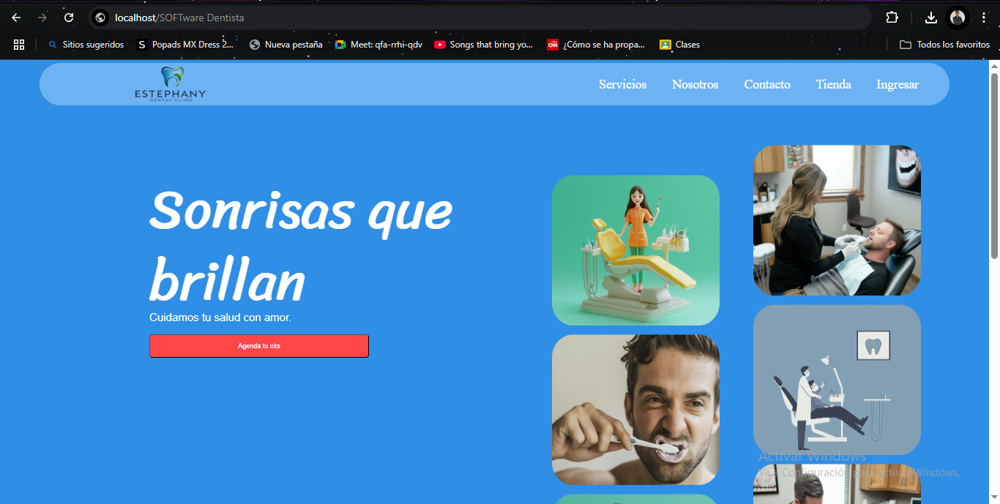
### Usuarios
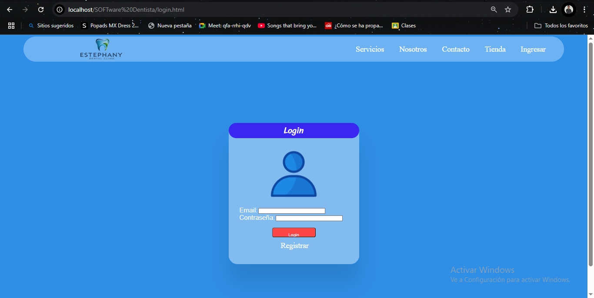
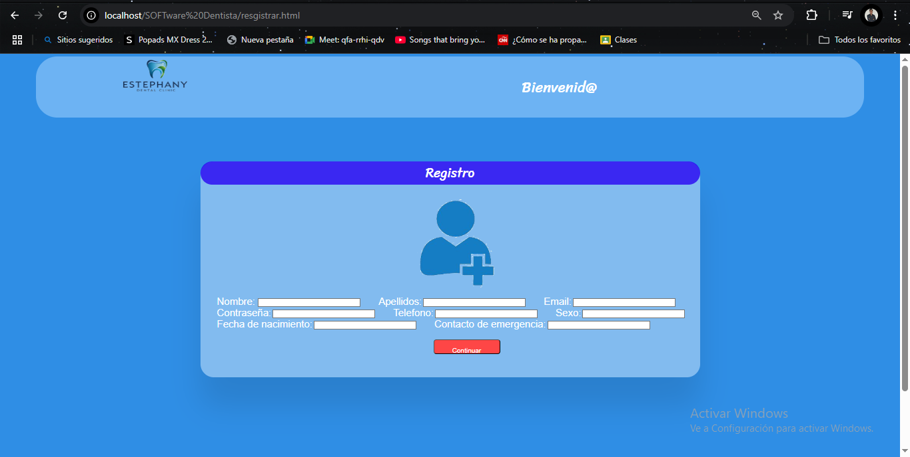
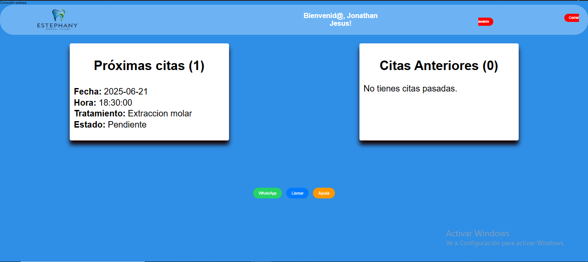

### Personal
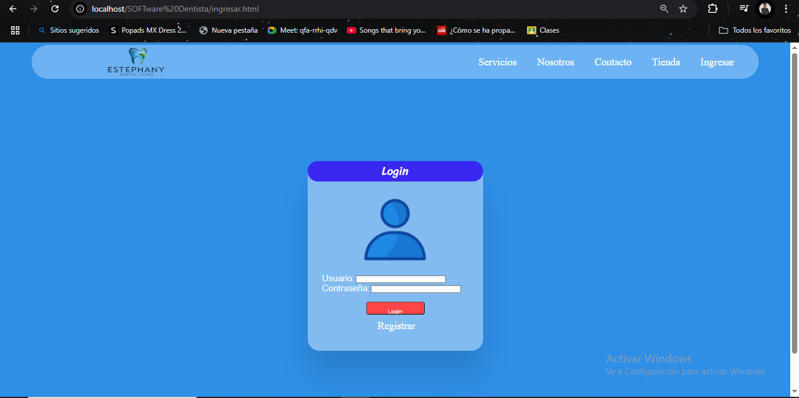
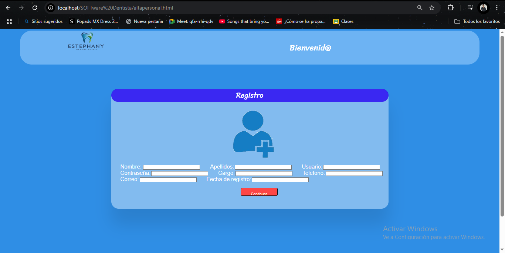
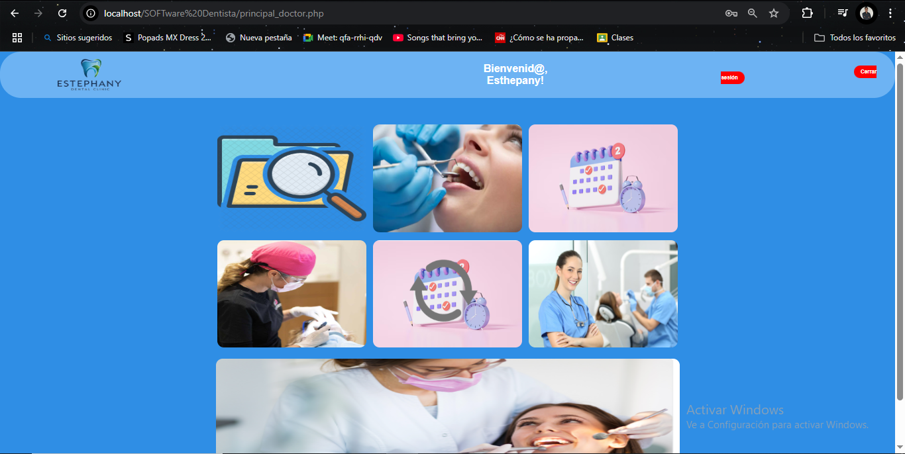
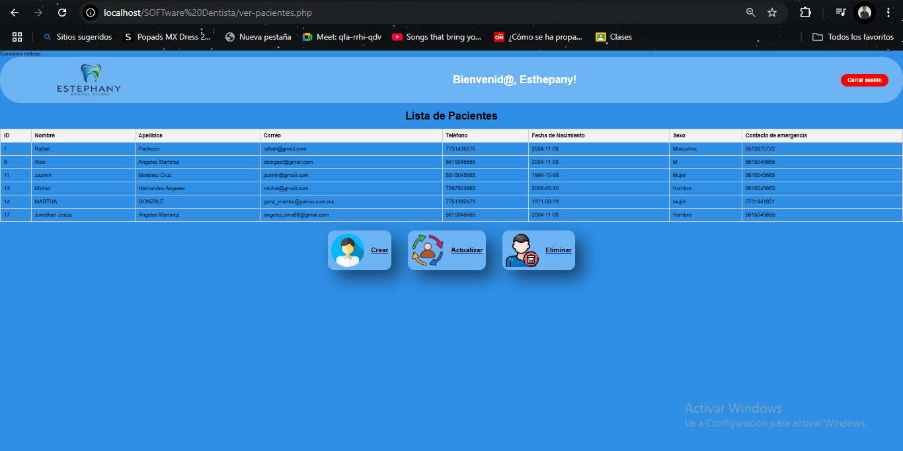
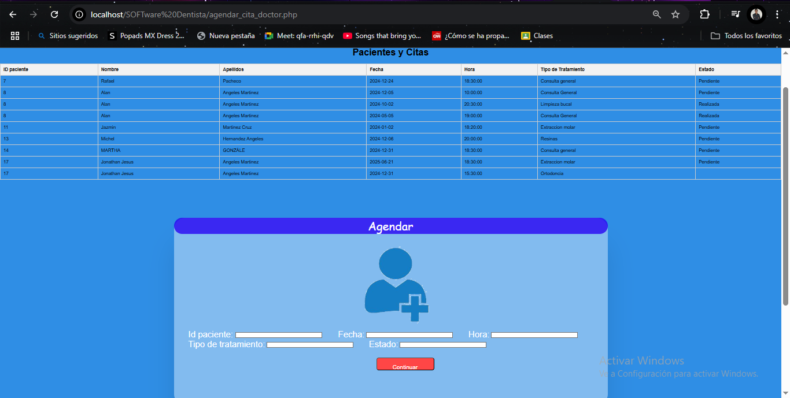
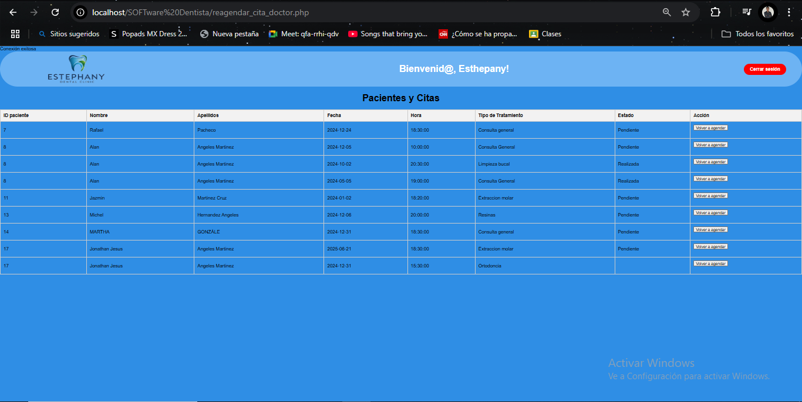

### Base de datos
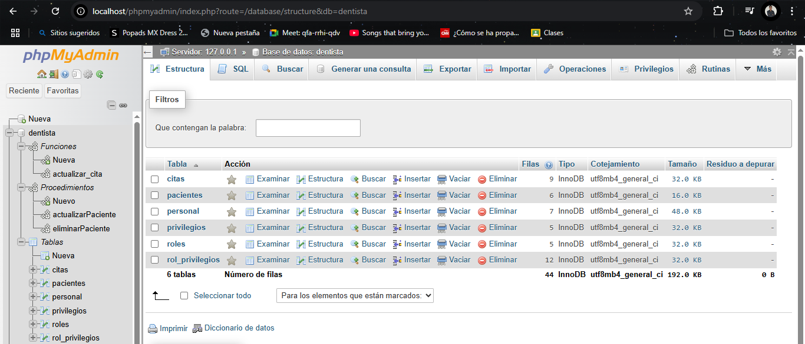

## ⚙️ Instalación local (paso a paso)

Sigue estas instrucciones para ejecutar correctamente el sistema en tu máquina local:

### 🔧 Requisitos previos

- Tener instalado [XAMPP](https://www.apachefriends.org/es/index.html)
- PHP 7.x u 8.x y MySQL (incluidos con XAMPP)
- Un navegador moderno (Chrome, Firefox, etc.)

---

### 🛠️ 1. Descargar y colocar el proyecto

1. Clona este repositorio o descárgalo en formato ZIP.
2. Descomprime el proyecto (si aplica) y **mueve la carpeta `SOFTWARE DENTISTA` a:** C:\xampp\htdocs\

### 🧩 2. Importar la base de datos

1. Abre el panel de control de **XAMPP**
2. Inicia los servicios de **Apache** y **MySQL**
3. Accede a [http://localhost/phpmyadmin](http://localhost/phpmyadmin)
4. Crea una nueva base de datos: **dentista**
5. Haz clic en **Importar**, selecciona el archivo: C:\xamppp\htdocs\Software Dentista\database\dentista.sql
y da clic en **Continuar**

---

### ⚙️ 3. Configurar conexión a la base de datos

1. Abre el archivo de configuración de la conexión a la base de datos: C:\xamppp\htdocs\Software Dentista\db_connect.php
2. Asegúrate de que los datos coincidan con los de tu entorno local:

```php
$host = "localhost";
$usuario = "root";
$password = ""; // sin contraseña por defecto en XAMPP
$bd = "dentista";
```
---

### ⚙️ 3. Configurar conexión a la base de datos
1. Abre tu navegador y entra a: http://localhost/SOFTware%20Dentista
2. Deberías ver la pantalla de inicio: 

